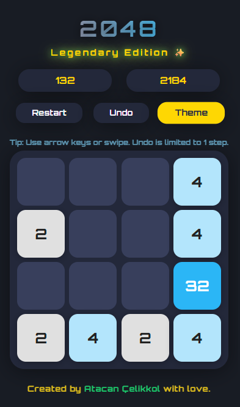

# 2048

A visually stunning, animated, and feature-rich version of the classic 2048 game, crafted by **Atacan Çelikkol**.

[**Play the Game**](https://atacan-celikkol.github.io/2048)

## Features

- **Legendary UI:** Neon gradients, glowing tiles, and smooth, modern design.
- **Beautiful Animations:** Tile pops, merges, and legendary tile glows.
- **Undo:** Revert your last move (limited to 1 step).
- **Multiple Themes:** Switch between dark, neon, and light themes.
- **Responsive:** Play on desktop or mobile (arrow keys or swipe).
- **Best Score Tracking:** Your best score is saved in your browser.
- **Win & Legendary Tiles:** Celebrate your 2048 win, and keep going for legendary 4096+ tiles!
- **No Ads & No Telemetry:** Enjoy uninterrupted gameplay.

## How to Play

- **Move tiles** with your arrow keys or swipe on mobile.
- When two tiles with the same number touch, they **merge into one**.
- Reach **2048** to win, or keep playing for legendary tiles!
- Use the **Undo** button to revert your last move.
- Switch themes anytime with the **Theme** button.
- Press **Restart** to start a new game.

## Screenshots

## Run Locally

1. Download or clone this repository.
2. Open `index.html` in your browser.

No dependencies required.

## Credits

- Game by **Atacan Çelikkol**
- Font: [Orbitron](https://fonts.google.com/specimen/Orbitron) by The League of Moveable Type

## License

MIT License

---

Enjoy the game and aim for legendary scores! 🚀
