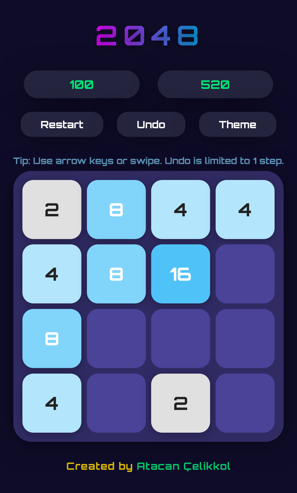

# 2048

A visually stunning, animated, lightweight version of the classic 2048 game, crafted by **Atacan Çelikkol**.

**No Ads & No Telemetry:** Enjoy uninterrupted gameplay on all devices.

## PLAY
[**Click Here to Play the Game 🎮**](https://atacan-celikkol.github.io/2048)

## How to Play

- **Move tiles** with your arrow keys or swipe on mobile.
- When two tiles with the same number touch, they **merge into one**.
- Reach **2048** to win, or keep playing for legendary tiles!
- Use the **Undo** button to revert your last move.
- Switch themes anytime with the **Theme** button.
- Press **Restart** to start a new game.

## Screenshots

## If You Want to Run Locally

1. Download or clone this repository.
2. Open `index.html` in your browser.

No dependencies required.

## Credits

- Game by **Atacan Çelikkol**
- Font: [Orbitron](https://fonts.google.com/specimen/Orbitron) by The League of Moveable Type

## License

MIT License

---

Enjoy the game and aim for legendary scores! 🚀
